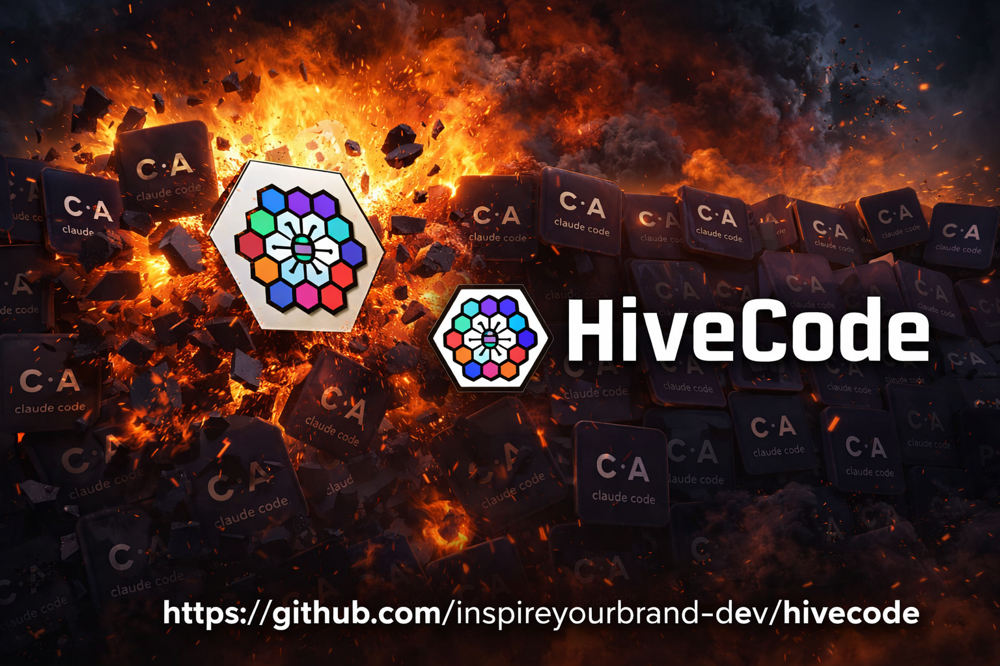

<p align="center">
  
</p>

<h1 align="center">HiveCode</h1>

<p align="center">
  <strong>The model-agnostic AI coding assistant.</strong><br/>
  Use any LLM — Claude, GPT, Gemini, or local models via Ollama — in a blazing-fast native desktop app.
</p>

<p align="center">
  <a href="#features">Features</a> •
  <a href="#quick-start">Quick Start</a> •
  <a href="#architecture">Architecture</a> •
  <a href="#providers">Providers</a> •
  <a href="#building">Building</a> •
  <a href="#license">License</a>
</p>

<p align="center">
  
  
  
  
  
</p>

---

## Why HiveCode?

| | HiveCode | Claude Code | Cursor | Aider |
|---|---|---|---|---|
| **Model Agnostic** | Any LLM | Claude only | Limited | Yes |
| **Local LLMs** | First-class | No | No | Yes |
| **Desktop UI** | Native (Tauri) | Terminal | Electron | Terminal |
| **Binary Size** | ~8 MB | ~80 MB | ~400 MB | ~50 MB |
| **RAM Usage** | ~50 MB | ~200 MB | ~500 MB | ~100 MB |
| **MCP Support** | Full | Full | Partial | No |
| **Standalone** | Yes | Yes | Yes | Yes |

HiveCode sits at the intersection of **model freedom**, **local LLM support**, **native desktop performance**, and **full MCP extensibility** — in a package 50x smaller than Cursor.

---

## Features

**Model Agnostic** — Switch between Anthropic Claude, OpenAI GPT, Google Gemini, or any local model running on Ollama, LM Studio, vLLM, or llama.cpp. One unified interface, any brain.

**Blazing Fast** — Rust core with zero garbage collection. Sub-100ms startup, 30-50 MB RAM at idle, and ripgrep-speed file search built in.

**Native Desktop** — Tauri v2 uses your OS native webview instead of bundling Chromium. You get a real desktop app in a 3-10 MB download.

**Full Tool Suite** — 15+ tools: file read/write/edit, bash execution, glob, grep, git operations, LSP integration, web fetch, Jupyter notebook editing, and multi-agent spawning.

**MCP Protocol** — Connect any Model Context Protocol server for extensible tool access. GitHub, databases, APIs — if there's an MCP server, HiveCode can use it.

**Security First** — Permission engine with 90+ command pattern classifications, path validation, sensitive file detection, and configurable allow/deny rules.

**Multi-Provider Auth** — API keys, OAuth 2.0 with PKCE for OpenAI/Anthropic platforms, and ChatGPT subscription session tokens. Multiple auth profiles per provider.

**Cloud + Local** — AWS Bedrock, Google Vertex AI, Anthropic Foundry, plus Ollama, LM Studio, vLLM, and any OpenAI-compatible endpoint.

**Session History** — Persistent conversation history with search, export (JSON/Markdown), auto-titling, and token tracking.

**Persistent Memory** — Remember user preferences, project context, code patterns, and corrections across sessions.

**Context Management** — Token tracking with cost calculation, context window monitoring, and conversation compaction to free up space.

**Multi-Agent System** — Spawn sub-agents for parallel task execution: code review, security review, exploration, verification, and custom agents.

**Plan Mode** — Create and execute structured plans with step dependencies, token estimation, and file tracking.

**Plugin System** — Extend HiveCode with tools, providers, themes, skills, and MCP plugins. Install from URLs with dependency management.

**Desktop Notifications** — Native OS notifications for long-running tasks, errors, and important events.

**Keyboard Shortcuts** — Full keyboard shortcut system with command palette (Ctrl+K), customizable bindings, and visual hints.

**Cost Tracking** — Real-time cost monitoring with per-model pricing, spending limits, and threshold alerts.

**Image + PDF** — Read and process images for vision-capable models. Extract text from PDFs with page range selection.

**Auto Updates** — Built-in update checker with stable, beta, and nightly channels via GitHub releases.

**Hooks System** — Pre/post execution hooks on any tool. Auto-lint on save, log all bash commands, inject context before tool runs, or block dangerous operations.

**HIVECODE.md** — Per-project configuration file (like CLAUDE.md). Customize behavior, allowed tools, file restrictions, and model preferences for each codebase.

**Model Routing** — Automatically use cheaper models (Haiku, GPT-4o-mini) for simple tasks and premium models (Opus, GPT-4o) for complex reasoning. Saves 60-80% on costs.

**Git-Aware Context** — Automatically discovers relevant files based on git diff, recent changes, and project structure. The AI already knows what you're working on.

**Prompt Caching** — Cache-aware message construction for Anthropic's prompt caching API. Up to 90% cost reduction on repeated context.

**Conversation Branching** — Fork any conversation to explore different approaches without losing the original thread. Compare branches side by side.

**Extended Thinking** — See the AI's chain-of-thought reasoning in a collapsible panel. Streaming display with token tracking.

**Parallel Tool Execution** — When the AI requests multiple independent tools, they run concurrently. Automatic dependency detection for safe parallelism.

**Streaming Diff View** — See file changes as they happen in real-time, with unified or side-by-side diff display.

**Session Replay** — Record and replay coding sessions. Great for teams, onboarding, and learning. Export to Markdown or JSON.

**Cost Optimizer** — "This session cost $4.20. With model routing, it would have been $0.85." Actionable recommendations to reduce spending.

**Offline Mode** — Seamless fallback to local Ollama models when internet is unavailable. Auto-restore when connectivity returns.

**Voice Mode** — Speech-to-text input via OpenAI Whisper, local Whisper, or system speech recognition. Hands-free coding.

**IDE Bridge** — Bidirectional communication with VS Code and JetBrains IDEs. File sync, diagnostics relay, and cursor context.

**Vim Keybindings** — Full vim motions, operators, text objects, and mode transitions for the input area.

**Team Coordination** — Orchestrate multiple AI agents working together with shared memory, task boards, and progress tracking.

**CLI Mode** — Full command-line interface with interactive REPL, streaming output, and 7 subcommands (chat, init, config, auth, plugins, doctor, update).

**Beautiful UI** — TRON-style neon design with dark/light themes, streaming markdown with syntax highlighting, collapsible tool panels, model selector, and settings management.

---

## Quick Start

### Prerequisites

- **Rust** 1.75+ — [Install](https://rustup.rs)
- **Node.js** 18+ — [Install](https://nodejs.org)
- **Tauri CLI** — `cargo install tauri-cli --version "^2.0"`

### Clone & Build

```bash
# Clone the repo
git clone https://github.com/inspireyourbrand-dev/hivecode.git
cd hivecode

# Install frontend dependencies
cd ui && npm install && cd ..

# Run in development mode (hot reload)
cargo tauri dev

# Or build for production (generates installer)
cargo tauri build
```

### One-Command Install (Windows)

If you've already cloned the repo, open PowerShell in the project folder:

```powershell
cd hivecode
powershell -ExecutionPolicy Bypass -File scripts\install-hivecode.ps1
```

This checks for Rust/Node.js, installs missing dependencies, builds the app, and offers to launch it.

### Configuration

Create the config directory and copy the example config:

```bash
# macOS/Linux
mkdir -p ~/.hivecode
cp config.example.toml ~/.hivecode/config.toml

# Windows (PowerShell)
New-Item -ItemType Directory -Force -Path "$env:USERPROFILE\.hivecode"
Copy-Item config.example.toml "$env:USERPROFILE\.hivecode\config.toml"
```

Edit `~/.hivecode/config.toml` and add your API keys:

```toml
[providers.anthropic]
api_key = "sk-ant-..."

[providers.openai]
api_key = "sk-..."

[providers.ollama]
base_url = "http://localhost:11434"
default_model = "llama3.3:70b"
```

No API keys? No problem — HiveCode works fully offline with [Ollama](https://ollama.com) local models.

---

## Architecture

```
┌──────────────────────────────────────────────────────────┐
│                    HIVECODE DESKTOP APP                   │
├──────────────────┬──────────────────┬────────────────────┤
│   UI FRONTEND    │   TAURI BRIDGE   │     RUST CORE      │
│  (React + TS)    │  (IPC Commands)  │     (Engine)       │
├──────────────────┼──────────────────┼────────────────────┤
│ Chat Interface   │ invoke()         │ LLM Providers      │
│ Code Viewer      │ events()         │ Tool Engine        │
│ File Explorer    │ State Sync       │ Shell Manager      │
│ Terminal Panel   │ Stream Relay     │ MCP Client         │
│ Settings UI      │                  │ Permission System  │
│ Model Selector   │                  │ Git Integration    │
└──────────────────┴──────────────────┴────────────────────┘
```

### Crate Structure

| Crate | Lines | Purpose |
|---|---|---|
| `hivecode-core` | 17,895 | 34 modules: conversation engine, auth, history, memory, hooks, model routing, git context, prompt caching, branching, thinking, offline mode, cost optimizer, streaming diff, session replay, voice, IDE bridge, vim mode, team coordination, keybinding config, and more |
| `hivecode-providers` | 3,719 | LlmProvider trait + 6 providers: OpenAI, Anthropic, Ollama, AWS Bedrock, Google Vertex, Foundry |
| `hivecode-tools` | 4,745 | Tool trait + 16 tools: bash, file ops, glob, grep, git, LSP, notebooks, agents, config, diff, parallel execution engine |
| `hivecode-security` | 896 | Permission engine, shell security, path validation, 90+ command patterns |
| `hivecode-mcp` | 882 | MCP JSON-RPC client with stdio transport, tool/resource discovery |
| `hivecode-tauri` | 4,214 | 100+ Tauri IPC commands across 16 command modules, events, query engine |
| `hivecode-cli` | 1,395 | CLI with 7 subcommands, interactive REPL, streaming output |
| **Frontend** | 6,080 | React 19 + TypeScript + Tailwind CSS + Zustand, 23 components, 3 stores |
| **Total** | **~40,000** | **7 Rust crates + React frontend** |

---

## Providers

HiveCode supports any LLM through a unified provider interface:

### Cloud Providers
- **Anthropic** — Claude Opus 4, Sonnet 4, Haiku (Messages API with streaming)
- **OpenAI** — GPT-4o, o1, o3 (Chat Completions API)
- **AWS Bedrock** — Claude models via AWS credentials and SigV4 signing
- **Google Vertex AI** — Claude models via Google Cloud project credentials
- **Anthropic Foundry** — Custom Anthropic endpoint for enterprise deployments

### Local Providers
- **Ollama** — Any model: Llama 3.3, CodeLlama, DeepSeek, Mistral, Qwen
- **LM Studio** — GGUF models with OpenAI-compatible API
- **vLLM** — High-throughput inference for self-hosted GPUs
- **llama.cpp server** — Direct HTTP API
- **Any OpenAI-compatible endpoint** — Generic provider

### Authentication
- **API Keys** — Direct API key authentication for all providers
- **OAuth 2.0 (PKCE)** — Secure OAuth flow for OpenAI Platform and Anthropic Console
- **ChatGPT Session** — Use your ChatGPT Plus/Team subscription via session token

The key insight: most local tools expose OpenAI-compatible APIs. A single provider implementation covers the entire local ecosystem.

---

## Building

### Development

```bash
cargo tauri dev          # Launch with hot reload
```

### Production Build

```bash
cargo tauri build        # Generates installer in target/release/bundle/
```

Tauri automatically generates:
- **Windows**: NSIS `.exe` installer + `.msi`
- **macOS**: `.dmg` disk image
- **Linux**: `.AppImage` + `.deb`

### Build Installer Manually

```powershell
# Windows — full build pipeline with progress output
powershell -ExecutionPolicy Bypass -File scripts\build-installer.ps1
```

---

## Project Structure

```
hivecode/
├── Cargo.toml                    # Workspace root
├── config.example.toml           # Example configuration
├── LICENSE
├── crates/
│   ├── hivecode-core/            # 34 modules: engine, auth, memory, hooks, branching, voice, vim, team, etc.
│   ├── hivecode-providers/       # 6 LLM providers: OpenAI, Anthropic, Ollama, Bedrock, Vertex, Foundry
│   ├── hivecode-tools/           # 16 tools + parallel execution engine
│   ├── hivecode-security/        # Permission engine, shell security, path validation
│   ├── hivecode-mcp/             # MCP JSON-RPC client
│   ├── hivecode-tauri/           # 100+ IPC commands across 16 command modules
│   └── hivecode-cli/             # CLI: REPL, 7 subcommands, terminal rendering
├── ui/                           # React 19 + TypeScript frontend
│   ├── src/
│   │   ├── components/           # 23 components: Chat, Auth, Thinking, DiffView, Branching, etc.
│   │   ├── stores/               # Zustand: chatStore, appStore, notificationStore
│   │   ├── hooks/                # useAutoScroll, useTheme
│   │   └── lib/                  # Tauri IPC bindings, types
│   ├── package.json
│   └── vite.config.ts
├── assets/                       # Icons, banners, installer assets
├── installers/                   # Platform-specific installer configs
│   ├── windows/                  # Inno Setup + PowerShell build script
│   ├── macos/                    # .app bundle + DMG + notarization
│   └── linux/                    # .deb/.AppImage + desktop entry
├── scripts/                      # Setup, build, installer scripts
└── tests/                        # Integration and E2E tests
```

---

## License

MIT License. See [LICENSE](LICENSE) for details.

---

<p align="center">
  Built by <a href="https://hivepowered.ai">HivePowered</a>
</p>
